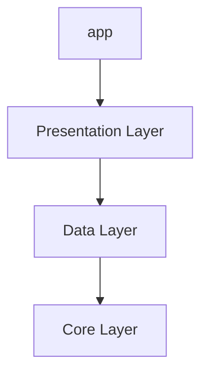
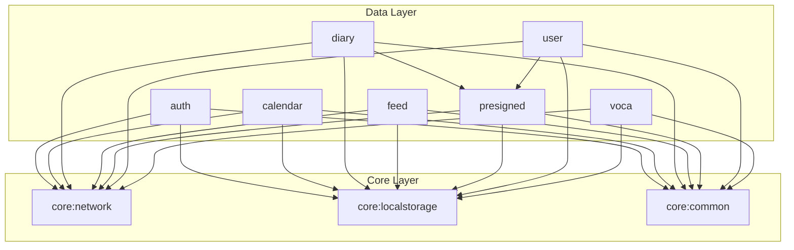
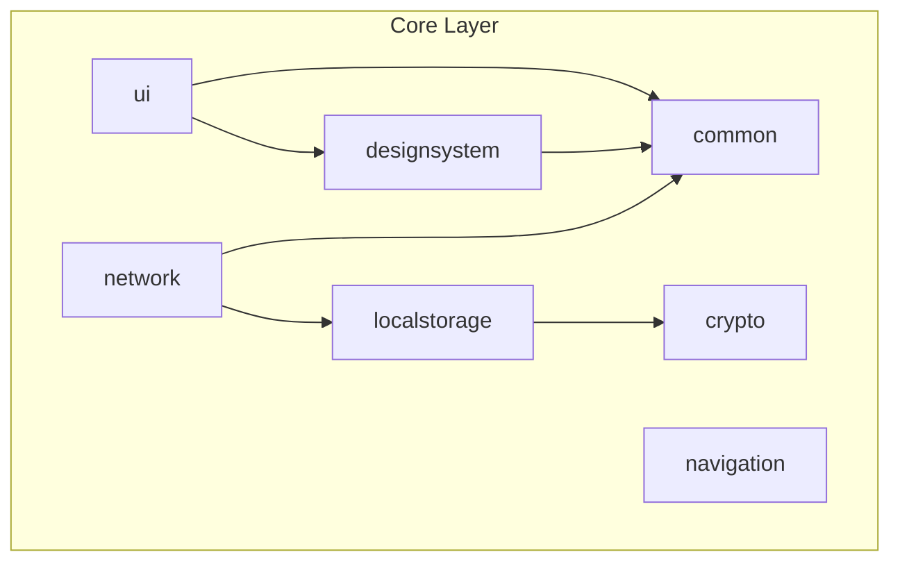

# Hi-lingual Android

## 1. 프로젝트 개요

- 하이링구얼(Hi-lingual)은 사용자가 영어로 일기를 작성하고 공유하며, AI를 통해 피드백을 받을 수 있는 소셜 네트워킹 서비스입니다. 영어 학습을 단순한 공부가 아닌, 일상의 기록과 소통의 도구로 활용하도록 돕는 것을 목표로 합니다.

## 2. 주요 기능

- **영어 일기 작성 및 관리:** 매일의 주제 또는 자유 주제로 영어 일기를 작성하고, 캘린더 뷰를 통해 기록을 한눈에 관리합니다.
- **AI 기반 피드백:** 작성한 일기에 대해 문법, 철자, 더 나은 표현 등 AI가 제공하는 상세한 피드백을 받을 수 있습니다.
- **소셜 피드:** 다른 사용자의 일기를 구독하고 '좋아요'나 댓글로 소통하며 함께 성장하는 학습 환경을 제공합니다.
- **개인화 단어장:** 피드백 받은 단어나 직접 추가한 단어를 모아보는 나만의 단어장 기능을 제공합니다.
- **사용자 프로필 및 팔로우:** 다른 사용자를 팔로우하고, 내 프로필에서 내가 작성한 일기나 '좋아요'한 일기를 모아볼 수 있습니다.

## 3. 아키텍처

### Google Recommended Architecture

프로젝트는 Google에서 권장하는 앱 아키텍처를 기반으로, **UI Layer - Data Layer**의 2-Layer 구조로 설계되었습니다. 각 계층은 단방향 데이터 흐름(UDF)을 따르며, MVVM 패턴을 적용하여 데이터와 UI를 분리했습니다.

### Modularization

앱의 확장성과 유지보수성을 높이기 위해 기능 및 계층 단위로 모듈을 분리했습니다. 의존성은 `presentation` → `data` → `core` 방향으로 흐르며, 순환 참조를 방지하고 모듈 간 결합도를 낮췄습니다.

## 4. 모듈 의존성 그래프 (Module Dependency Graph)

### High-Level Architecture

### Presentation Layer Dependencies

> presentation:main 모듈은 아래 그래프의 모든 Presentation 모듈을 포함하며,
> 
> 
> 모든 Presentation 모듈은 공통적으로 **core:ui**와 **core:navigation** 모듈에 의존합니다.
> 

```mermaid
graph TD
    subgraph Presentation Layer
        auth["auth"]
        diaryfeedback["diaryfeedback"]
        diarywrite["diarywrite"]
        feed["feed"]
        feeddiary["feeddiary"]
        feedprofile["feedprofile"]
        home["home"]
        mypage["mypage"]
        notification["notification"]
        onboarding["onboarding"]
        otp["otp"]
        splash["splash"]
        voca["voca"]
    end

    subgraph Data Layer
        data_auth["data:auth"]
        data_calendar["data:calendar"]
        data_diary["data:diary"]
        data_feed["data:feed"]
        data_user["data:user"]
        data_voca["data:voca"]
    end

    auth --> data_auth
    auth --> data_user
    diaryfeedback --> data_diary
    diarywrite --> data_calendar
    diarywrite --> data_diary
    feed --> data_feed
    feed --> data_diary
    feed --> data_user
    feeddiary --> data_diary
    feeddiary --> data_feed
    feeddiary --> data_user
    feedprofile --> data_feed
    feedprofile --> data_user
    feedprofile --> data_diary
    home --> data_user
    home --> data_diary
    home --> data_calendar
    mypage --> data_user
    mypage --> data_auth
    notification --> data_user
    onboarding --> data_user
    otp --> data_user
    otp --> data_auth
    splash --> data_auth
    splash --> data_user
    voca --> data_voca
    voca --> data_diary

```

### Data Layer Dependencies

### Core Layer Dependencies

## 5. 적용 기술 (Core Technologies)

| 구분 | 기술 | 설명 |
| --- | --- | --- |
| **Architecture** | MVVM, UDF, Repository Pattern | Google 권장 아키텍처 기반의 단방향 데이터 흐름 구현 |
| **UI** | Jetpack Compose | 100% Kotlin으로 선언형 UI 구현 |
| **DI** | Dagger-Hilt | 의존성 주입을 통한 객체 생명주기 관리 및 결합도 감소 |
| **Asynchronous** | Coroutine, Flow | 비동기 처리 및 데이터 스트림 관리 |
| **Navigation** | Compose Navigation | Type-safe한 화면 이동 구현 |
| **Network** | Retrofit, OkHttp, Kotlinx.Serialization | REST API 통신 및 JSON 직렬화/역직렬화 |
| **Local Storage** | Jetpack DataStore, AndroidKeyStore | `AndroidKeyStore`와 `javax.crypto`를 활용한 암호화된 Key-Value 데이터의 비동기적 저장 |
| **Analytics** | Firebase Crashlytics, Amplitude | 크래시 리포트 및 사용자 행동 분석 |
| **Performance** | Baseline Profile | 앱 실행 및 렌더링 성능 최적화 |
| **Build** | Gradle, Version Catalog, Convention Plugin | Version Catalog를 통한 의존성 버전 관리 및 Convention Plugin을 통한 빌드 로직 재사용 |

## 6. 주요 기술 구현 및 기여

리드 개발자로서 프로젝트의 초기 설정부터 전체 아키텍처 설계, 핵심 기능 구현 및 배포까지 주도적인 역할을 수행했습니다.

### **1. 모던하고 확장 가능한 아키텍처 설계 및 구축**

- **Gradle Convention Plugin 기반 모듈화:** 유지보수성과 확장성을 고려하여 `app`, `presentation`, `data`, `core`의 4개 레이어로 모듈 구조를 설계했습니다. `build-logic` 모듈 내에 **Gradle Convention Plugin**을 직접 구현하여, 모듈별 빌드 구성을 중앙에서 일관되게 관리하고 `build.gradle.kts`의 복잡성을 줄였습니다.
- **인증 시스템:** `OkHttp Interceptor`와 `Authenticator`를 활용하여 **Access Token 만료 시 자동으로 갱신**하는 로직을 구현했습니다. 이를 통해 API 통신의 안정성과 사용자 경험을 모두 개선했습니다.
- **전역 UI 상태 관리 시스템:** `CompositionLocalProvider`를 활용하여 `Snackbar`, `Dialog` 등 공통 UI 이벤트를 전역에서 관리하는 `Trigger`를 구현했습니다. 이를 통해 ViewModel과 Composable 간의 결합도를 낮추고, UI 이벤트 처리를 단순화하여 코드의 재사용성을 높였습니다.
- **데이터 보안:** `AndroidKeyStore`와 `javax.crypto` (AES/CBC/PKCS7)를 직접 활용하여 `DataStore`에 저장되는 토큰 등 민감 데이터를 **암호화**하는 `core:crypto` 모듈을 구현하여 로컬 저장소의 보안을 강화했습니다.

### **2. 핵심 기능 개발 및 성능 최적화**

- **커스텀 캘린더 구현:**
    - `LazyRow`를 기반으로 월 단위로 스크롤되는 캘린더를 구현했습니다. 각 월은 `Column`과 `Row`를 사용해 직접 그려냈습니다.
    - `rememberSnapFlingBehavior`와 커스텀 `SnapLayoutInfoProvider`를 조합하여, 스크롤 시 **각 월의 시작 부분에 정확히 멈추는(snapping)** 동작을 구현하여 부드러운 사용자 경험을 제공했습니다.
    - `snapshotFlow`를 사용하여 스크롤이 멈췄을 때만 `onMonthChanged` 콜백을 호출하도록 구현, 불필요한 API 호출을 방지하고 성능을 최적화했습니다.
- **Presigned URL을 이용한 이미지 처리:** 서버 부하 감소와 전송 속도 개선을 위해 **Presigned URL** 방식을 도입, 클라이언트가 AWS S3에 직접 이미지를 업로드하도록 구현했습니다. 또한, `Coroutine`을 활용한 비동기 압축 로직을 추가하여 데이터 사용량을 최적화했습니다.
- **인증 플로우 전체 구현:** Google 로그인 SDK 연동, 자체 서버를 이용한 로그인/회원가입, 자동 로그인, OTP 인증 등 앱의 전체적인 인증 흐름을 설계하고 구현했습니다.
- **앱 성능 최적화:** `Baseline Profile`을 생성하고 적용하여 앱의 초기 실행 및 화면 전환 속도를 **약 13% 개선**했습니다. 또한 `Coil3`로 이미지 로딩 라이브러리를 마이그레이션하고, 불필요한 리컴포지션을 최소화하여 UI 렌더링 성능을 향상시켰습니다.

### **3. 개발 생산성 및 안정성 향상**

- **CI/CD 파이프라인 구축:** `GitHub Actions`를 활용하여 PR 생성 시 `ktlint`, `spotless`를 통한 코드 스타일 검사와 `build`를 자동화하는 CI 환경을 구축하여 코드 품질을 일관되게 유지했습니다.
- **의존성 관리 자동화:** `Renovate Bot`을 도입하여 라이브러리 의존성을 자동으로 업데이트하고, `Version Catalog`를 통해 프로젝트 전체의 의존성 버전을 중앙에서 관리하여 버전 충돌 문제를 예방했습니다.
- **데이터 기반 개선 환경 마련:** `Firebase Crashlytics`를 도입하여 크래시를 추적하고, `Amplitude`를 연동하여 사용자 주요 행동 이벤트를 로깅함으로써 데이터에 기반한 서비스 개선 환경을 구축했습니다.
